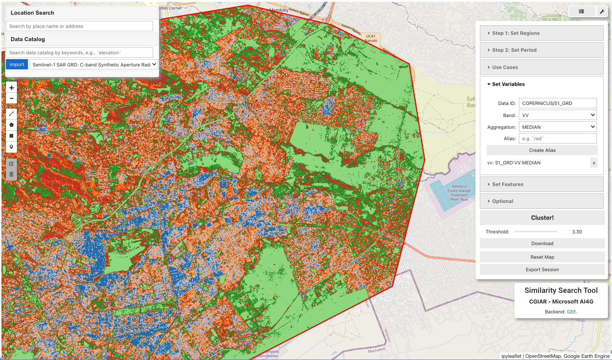

# Sims

<p align="center">
  
</p>

`Sims` is an interactive web tool that helps users find similar geographical regions or cluster areas based on environmental characteristics. Using Google Earth Engine as backend, it allows you to select a reference area and find other locations that share similar features like rainfall patterns, soil composition, vegetation indices, and land cover types. This makes it particularly valuable for agricultural planning, environmental research, and land-use analysis.

## Getting Started

Complete, step-by-step setup instructions (including Google Cloud Platform prerequisites, Earth Engine access, and local or containerized execution options) are documented in [`SETUP.md`](SETUP.md).

## Local Development

If you have completed the steps in [`SETUP.md#option-a-run-sims-on-your-computer-no-container`](SETUP.md#option-a-run-sims-on-your-computer-no-container), you can start a local development server with:

```bash
cd scripts/
solara run app.py
```

## Deployment

A Docker-based deployment path with credential management options is also covered in [`SETUP.md#option-b-run-sims-with-docker-containerized`](SETUP.md#option-b-run-sims-with-docker-containerized). Refer to that guide for image build commands and runtime configuration details.

## Contributing

This project welcomes contributions and suggestions.  Most contributions require you to agree to a Contributor License Agreement (CLA) declaring that you have the right to, and actually do, grant us the rights to use your contribution. For details, visit https://cla.opensource.microsoft.com.

When you submit a pull request, a CLA bot will automatically determine whether you need to provide a CLA and decorate the PR appropriately (e.g., status check, comment). Simply follow the instructions provided by the bot. You will only need to do this once across all repos using our CLA.

This project has adopted the [Microsoft Open Source Code of Conduct](https://opensource.microsoft.com/codeofconduct/). For more information see the [Code of Conduct FAQ](https://opensource.microsoft.com/codeofconduct/faq/) or contact [opencode@microsoft.com](mailto:opencode@microsoft.com) with any additional questions or comments.

## Trademarks

This project may contain trademarks or logos for projects, products, or services. Authorized use of Microsoft  trademarks or logos is subject to and must follow [Microsoft's Trademark & Brand Guidelines](https://www.microsoft.com/en-us/legal/intellectualproperty/trademarks/usage/general). Use of Microsoft trademarks or logos in modified versions of this project must not cause confusion or imply Microsoft sponsorship. Any use of third-party trademarks or logos are subject to those third-party's policies.

## License

This project is licensed under the [MIT License](LICENSE).
