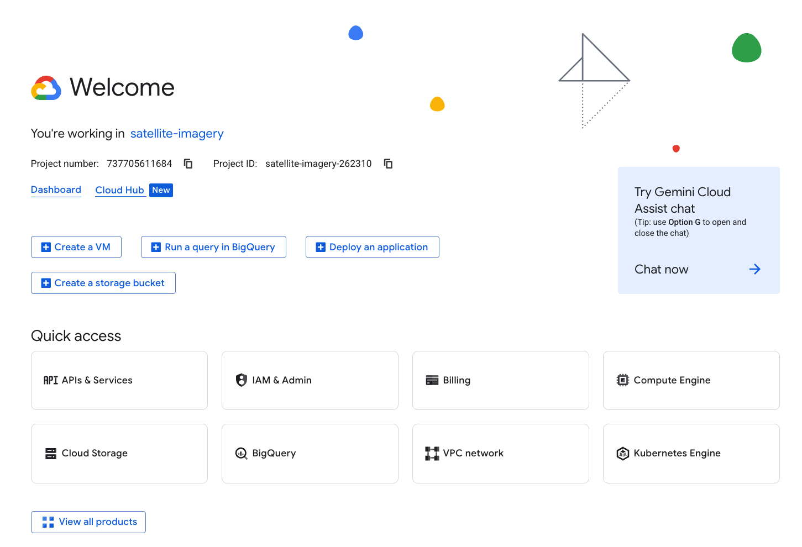
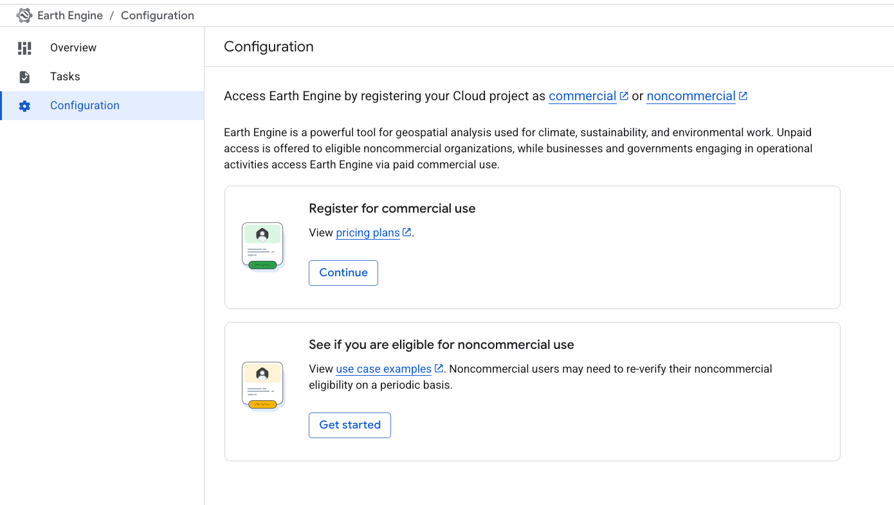
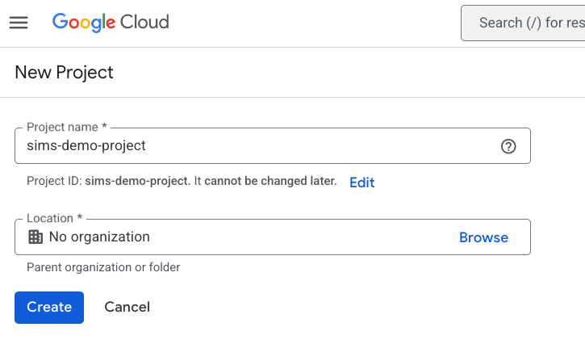
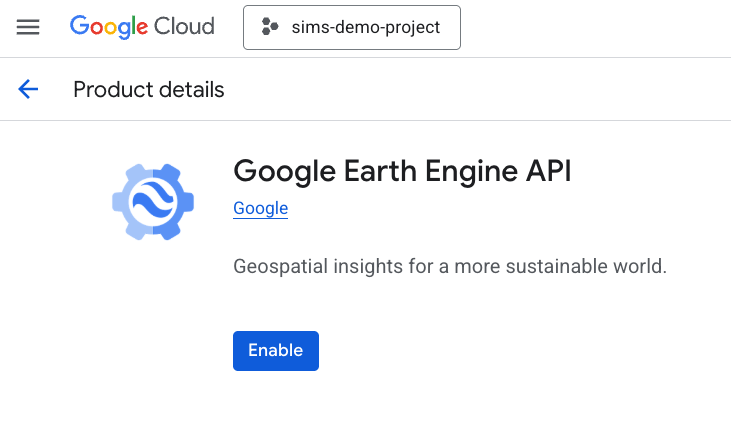
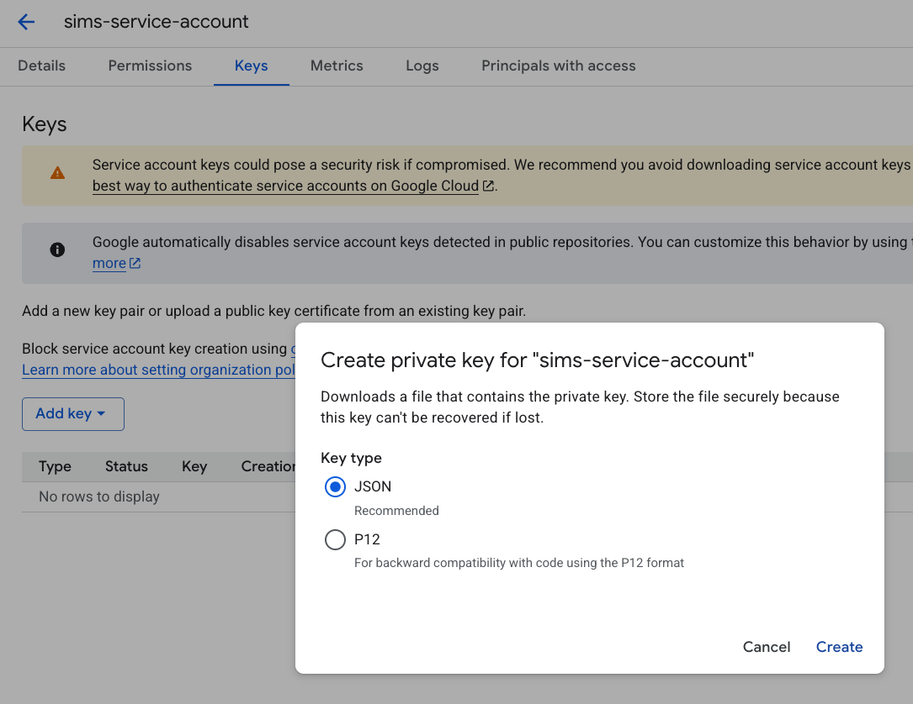
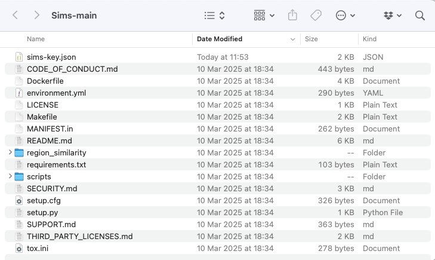
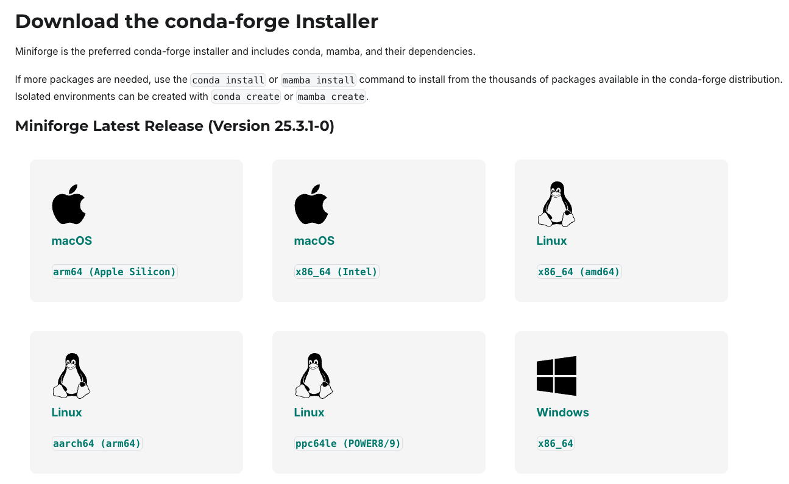
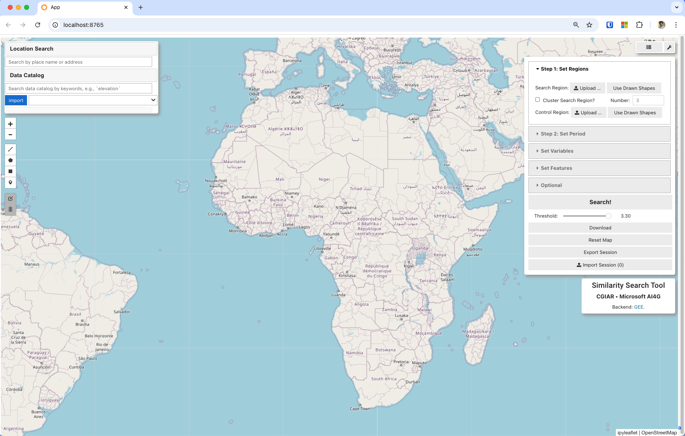

# Sims Setup Guide

This walkthrough does not require prior cloud or programming experience. Follow the steps in order and you will finish with a running copy of the tool on your own computer.

## Table of Contents
- [What You Need Before You Begin](#what-you-need-before-you-begin)
- [Step 1: Request Earth Engine Access (one-time)](#step-1-request-earth-engine-access-one-time)
- [Step 2: Create or Select a Google Cloud Project](#step-2-create-or-select-a-google-cloud-project)
- [Step 3: Enable the Earth Engine API](#step-3-enable-the-earth-engine-api)
- [Step 4: Create a Service Account and Download the Key File](#step-4-create-a-service-account-and-download-the-key-file)
- [Step 5: Share the Service Account with Earth Engine](#step-5-share-the-service-account-with-earth-engine)
- [Step 6: Download the Sims Project Files](#step-6-download-the-sims-project-files)
- [Step 7: Decide How You Want to Run Sims](#step-7-decide-how-you-want-to-run-sims)
  - [Option A: Run Sims on Your Computer (no container)](#option-a-run-sims-on-your-computer-no-container)
  - [Option B: Run Sims with Docker (containerized)](#option-b-run-sims-with-docker-containerized)
- [Step 8: Launch Sims and Sign In](#step-8-launch-sims-and-sign-in)
- [Troubleshooting and Support](#troubleshooting-and-support)

---

## What You Need Before You Begin
- A Google account with access to Google Cloud Platform (GCP).
- Approval to use GEE. If you have never used GEE before, you will request access in Step 1.



---

## Step 1: Request Earth Engine Access (one-time)
If your organization already uses Earth Engine with service accounts, confirm with your administrator that you have access. Otherwise:

1. Visit https://earthengine.google.com/signup/ while signed into your Google account.
2. Complete the short form. Select the same Google account you plan to use for Sims.
3. Submit the request. Google usually approves within a few minutes, but in some cases it can take up to 24 hours.
4. Keep this page open or bookmark it—you will return when you share the service account in Step 5.



---

## Step 2: Create or Select a Google Cloud Project
You can use an existing GCP project if your organization already has one dedicated to Earth Engine work. Otherwise, create a new lightweight project.

1. Go to https://console.cloud.google.com/ and sign in.
2. In the top navigation bar, click the project drop-down and choose **New Project**.
3. Enter a project name you will recognize later (example: `sims-demo-project`). Note the Project ID that Google generates—it must be unique.
4. Choose your organization or create the project under your personal account if prompted.
5. Click **Create**. Wait for the confirmation toast in the upper-right corner, then click **Select Project** to switch into it.



---

## Step 3: Enable the Earth Engine API

1. With your project selected, open the left navigation menu and choose **APIs & Services → Library**.
2. Search for “Earth Engine API”.
3. Click the result labeled **Earth Engine API** and press the **Enable** button.
4. Wait until the API dashboard opens; this confirms the API is active for your project.

Optional (recommended): also enable the **Cloud Storage** API to allow downloads from Sims.



---

## Step 4: Create a Service Account and Download the Key File
Sims uses a service account to authenticate with Earth Engine. You will create the account in the Google Cloud Console (no command line required).

1. In the left navigation menu, choose **IAM & Admin → Service Accounts**.
2. Click **+ CREATE SERVICE ACCOUNT** at the top.
3. Fill in the form:
   - Service account name: `sims-service-account` (or another descriptive name).
   - Service account ID: Google fills this automatically.
   - Description: “Service account used by Sims to access Earth Engine.”
4. Click **Create and Continue**.
5. In the “Grant this service account access to project” step, click **Select a role**, then select **Storage Object Viewer**. (This allows Sims to read raster exports.)
6. Click **Continue**, then **Done**.
7. Find your new service account in the list and click its email address.
8. Open the **Keys** tab, click **Add Key → Create new key**, select **JSON**, and click **Create**. Google downloads a file similar to `sims-service-account-123456.json`.
9. Store this file in a safe location. You will move it into the Sims project folder in Step 6.



---

## Step 5: Download the Sims Project Files
You can either download a ZIP archive or use Git if you already have it installed. The ZIP option is recommended for non-technical users.

1. Navigate to the Sims GitHub repository homepage.
2. Click the **Code** button and choose **Download ZIP**.
3. Save the ZIP file to a folder such as `Documents/Sims`.
4. Right-click the ZIP file and choose **Extract All** (Windows) or double-click it (macOS/Linux). A folder named `Sims-main` (or similar) appears.
5. Move the JSON key file you downloaded in Step 4 into this folder and rename it to `sims-key.json` for consistency.



---

## Step 6: Decide How You Want to Run Sims
Choose the option that matches your comfort level and organizational policies:

- **Option A – Run Sims on your computer**: Recommended if you prefer a straightforward Python environment without containers. Works offline after installation.
- **Option B – Run Sims with Docker**: Keeps everything isolated inside a container. Recommended if you already use Docker or want to deploy to a server.

You only need to complete one option. You can always switch later by returning to this step.

---

## Option A: Run Sims on Your Computer (no container)

### A.1 Install Miniforge (Mamba)
Mamba is a faster version of Conda used to manage Python environments.

1. Visit https://conda-forge.org/download/
2. Pick the installer that matches your operating system:
   - **Windows**: download `Miniforge3-Windows-x86_64.exe`, double-click it, and follow the wizard.
   - **MacOS & Linux**: run `bash Miniforge3-$(uname)-$(uname -m).sh`
3. Restart your terminal or command prompt after installation so that the `mamba` command is available.



### A.2 Open a Terminal in the Sims Folder
- Windows: In File Explorer, open the Sims folder, then click in the address bar, type `cmd`, and press Enter.
- macOS: Open Finder, right-click the Sims folder, choose **Services → New Terminal at Folder** (enable in System Settings if needed).
- Linux: Open the file manager, right-click the Sims folder, and choose **Open in Terminal**.

### A.3 Create the Sims Environment and Install Dependencies
Copy and paste the following commands into the terminal one at a time. Press Enter after each command and wait until it completes.

```bash
mamba create -n sims python=3.12.3 -y
mamba activate sims
mamba install conda-forge::gdal -y
pip install -r requirements.txt
pip install -e .
```

### A.4 Store Your Credentials in a `.env` File
Sims reads settings from a `.env` file automatically (using `python-dotenv`).

1. In the Sims project folder, copy `.env.example` to a new text file named `.env` (Windows may ask for confirmation because filenames that start with a dot are hidden by default).
2. Update the following lines, replacing the placeholder path with the full path to your `credentials.json` file:

   ```
   GOOGLE_APPLICATION_CREDENTIALS=/full/path/to/credentials.json
   HOST=localhost:8080
   ```

3. Save the file. The tool will read these values the next time it runs.

### A.5 Start Sims

1. Ensure the terminal still shows `(sims)` and you are inside the project folder.
2. Run:

   ```bash
   cd scripts
   solara run app.py
   ```

3. Wait until Solara reports that the app is running.
4. Leave this terminal window open while you use Sims. To stop the app, press `Ctrl + C`.



---

## Option B: Run Sims with Docker (containerized)

### B.1 Install Docker Desktop
1. Download Docker Desktop from https://www.docker.com/products/docker-desktop/.
2. Run the installer and follow the on-screen instructions.
3. After installation, launch Docker Desktop to confirm it starts without errors.

### B.2 Prepare the Credentials File
1. Place your `sims-key.json` file inside the project folder if you have not already.
2. Rename it to `credentials.json` if you prefer the naming used in the Docker commands below.

### B.3 Build the Sims Docker Image
1. Open a terminal in the Sims folder (see Option&nbsp;A.2 for tips).
2. Run:

   ```bash
   docker build -t sims-app .
   ```

3. Docker downloads dependencies and builds the image. This step can take several minutes the first time.

### B.4 Run the Container (two options)

**Option 1 — Mount the credentials file (recommended for testing)**

```bash
docker run -it ^
  -p 8080:8080 ^
  -v "%cd%/credentials.json:/app/credentials.json" ^
  -e GOOGLE_APPLICATION_CREDENTIALS=/app/credentials.json ^
  -e HOST="localhost:8080" ^
  sims-app
```

For macOS or Linux, replace `^` with `\` and `%cd%` with `$(pwd)`:

```bash
docker run -it \
  -p 8080:8080 \
  -v $(pwd)/credentials.json:/app/credentials.json \
  -e GOOGLE_APPLICATION_CREDENTIALS=/app/credentials.json \
  -e HOST="localhost:8080" \
  sims-app
```

**Option 2 — Store credentials as an environment variable (recommended for deployment)**

1. Encode the JSON file:

   - macOS/Linux:
     ```bash
     export GOOGLE_CREDENTIALS="$(base64 < credentials.json | tr -d '\n')"
     ```
   - Windows PowerShell:
     ```powershell
     $env:GOOGLE_CREDENTIALS = [Convert]::ToBase64String([System.Text.Encoding]::UTF8.GetBytes((Get-Content -Raw credentials.json)))
     ```

2. Run the container:
   ```bash
   docker run -it \
     -p 8089:8089 \
     -e GOOGLE_CREDENTIALS="$GOOGLE_CREDENTIALS" \
     sims-app
   ```

---

## Step 7: Launch Sims and Sign In

1. Open your browser and go to `http://localhost:8080`.
2. When prompted, sign in with the Google account that created or was granted access to the service account.
3. If Sims loads without error, you are ready to explore. Start by selecting a reference area and choosing a dataset from the Earth Engine catalog.
4. Keep the terminal/Docker window running while you use the tool. Close the window or press `Ctrl + C` when you finish.

---

## Troubleshooting and Support
- **“You do not have permissions” errors**: Confirm that the service account was allowed in Earth Engine (Step 5) and that the JSON key file matches the service account.
- **`GOOGLE_APPLICATION_CREDENTIALS` not found**: Double-check the path inside your `.env` file (Option A) or the volume mount (Option B).
- **`gdal` installation fails on Windows**: Ensure you opened the Miniforge Prompt (not Command Prompt) and that you ran the terminal as an administrator the first time.
- **Nothing appears at http://localhost:8080**: Verify that the Solara or Docker process is still running and that no other application is using port 8080.
- **Need to add team members**: Share the service account JSON file securely, or create a new key for each member. Repeat Steps 5–8 for each person.

If you need more help, open an issue in the GitHub repository or reach out to your technical support contact.

---
